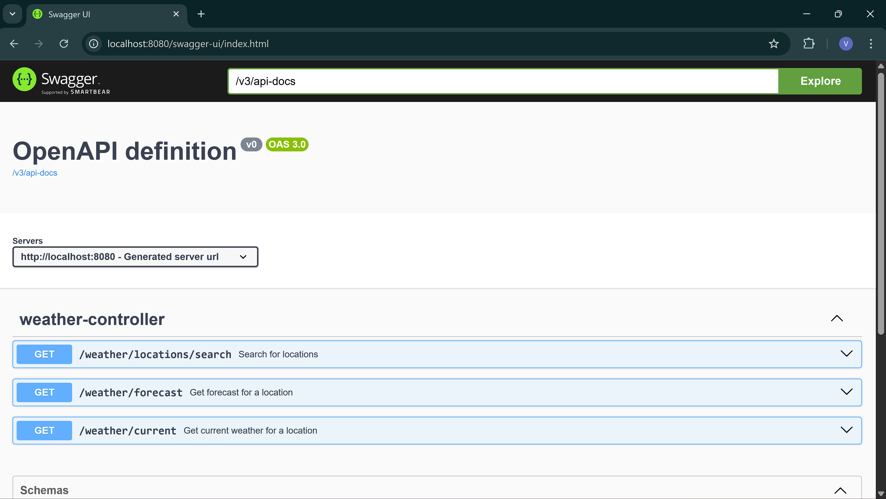
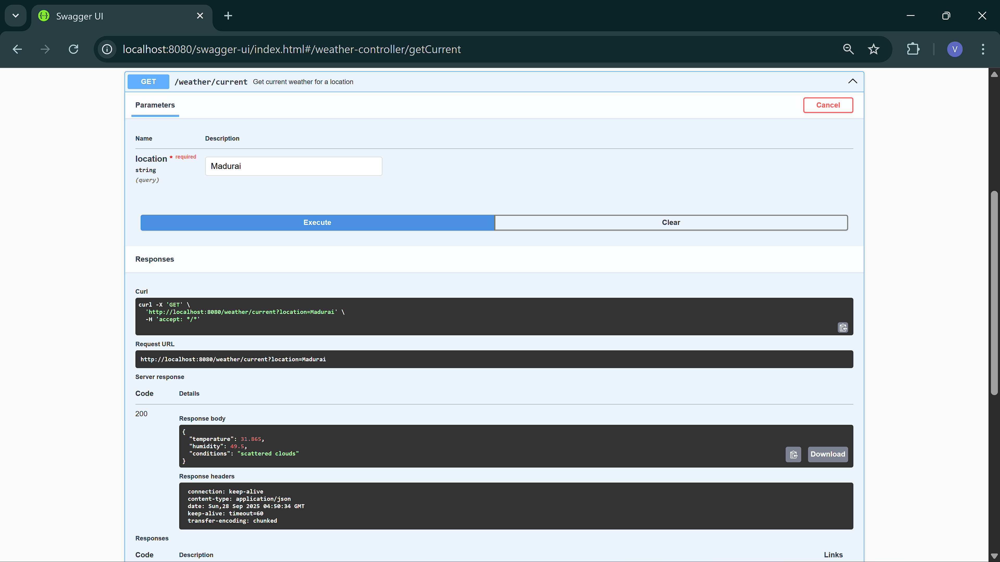
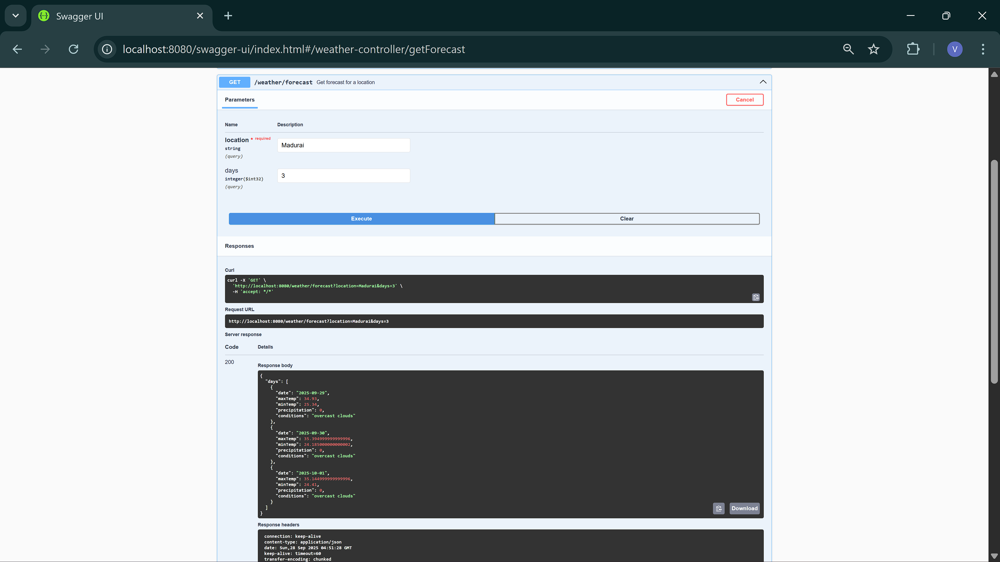
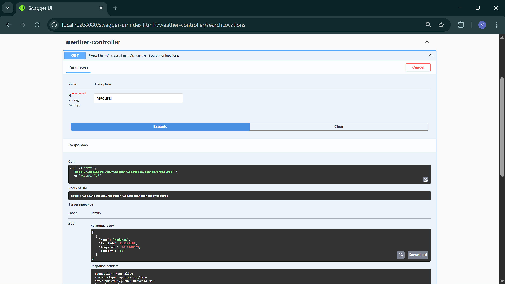
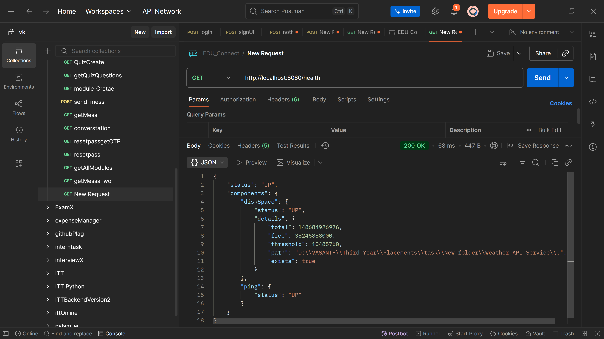
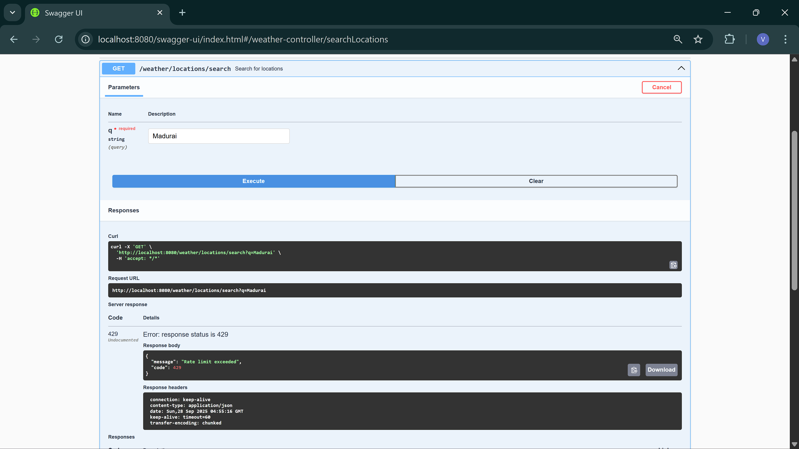

# Weather API Service

A Spring Boot REST API that aggregates weather data from OpenWeatherMap and Open-Meteo, with caching, rate limiting, and Swagger documentation.

## Approach
I chose Task 2 over Task 1 (React project) and Task 3 (basic API endpoints) because it allowed me to explore advanced topics like caching and rate limiting. This aligns with my Java skills (top 10% on LeetCode/HackerRank) and internship experience (e.g., INTRAINTECH AI bot, EduConnect full-stack), giving me a chance to tackle more complex backend challenges.

## Setup
### Prerequisites
- Java 21
- Maven
- OpenWeatherMap API key (free tier: https://openweathermap.org/api)

### Installation
1. Clone the repo:
2. Set API key as an environment variable:
- `export OPENWEATHERMAP_API_KEY=your_api_key` (or set in IDE)
- Update `application.properties`:
- Add `application.properties` to `.gitignore`.
3. Build:

### Run
- Start the app:
- Access at `http://localhost:8080`.
- View Swagger UI: `http://localhost:8080/swagger-ui.html`.

## Endpoints
- **GET /weather/current?location={city}**: Current weather (temp, humidity, conditions).
- **GET /weather/forecast?location={city}&days={n}**: Forecast (default 5 days).
- **GET /weather/locations/search?q={query}**: Search locations.
- **GET /health**: Health check.

## Features
- Aggregates data from two APIs.
- 5-min TTL caching with Caffeine.
- 50 requests/minute rate limiting with Bucket4j.
- Error handling with JSON responses.

## Screenshots
  
*API documentation.*

  
*Sample current weather response.*

  
*Sample forecast response.*

  
*Sample location search.*

  
*Health status.*

  
*Rate limit exceeded.*

## Troubleshooting
- **No logs**: Ensure `logging.level.com.example.weather_api=DEBUG` in `application.properties`.
- **API key**: Verify env var and test `/weather/locations/search`.
- **Rate limit**: Adjust capacity if needed.
- **Health**: Check `management.endpoints.web.base-path=/`.
